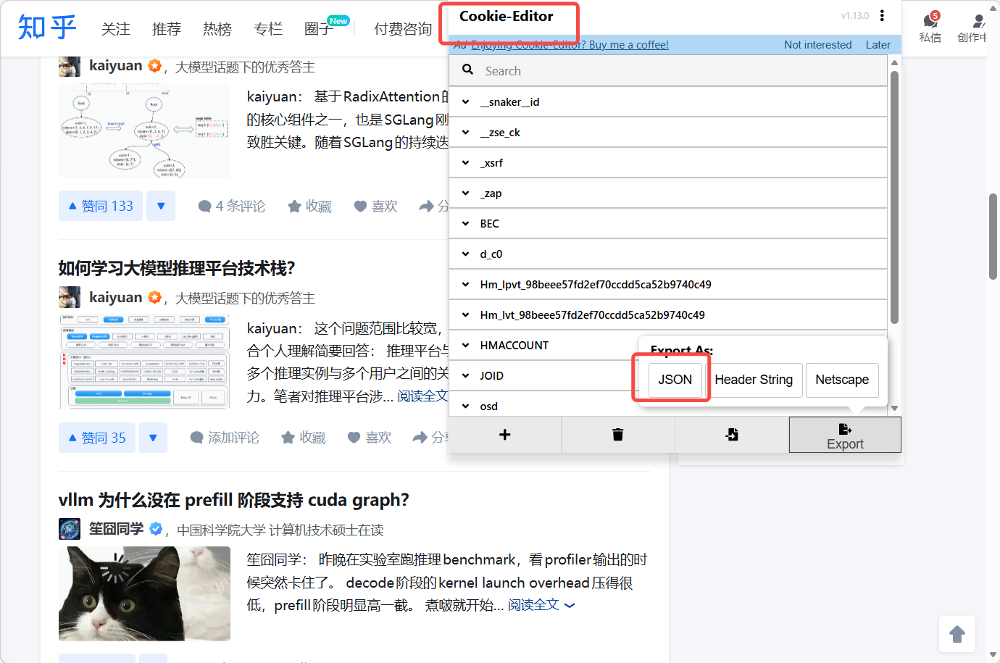
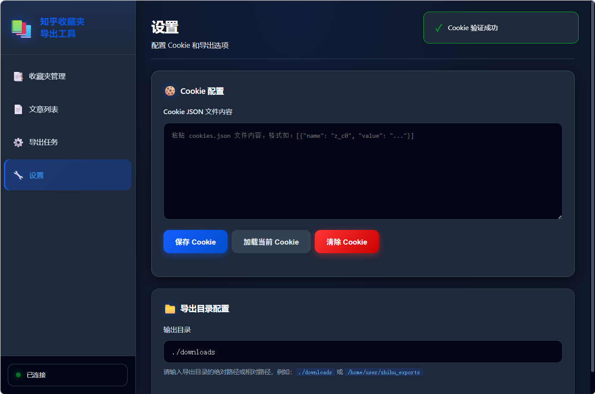
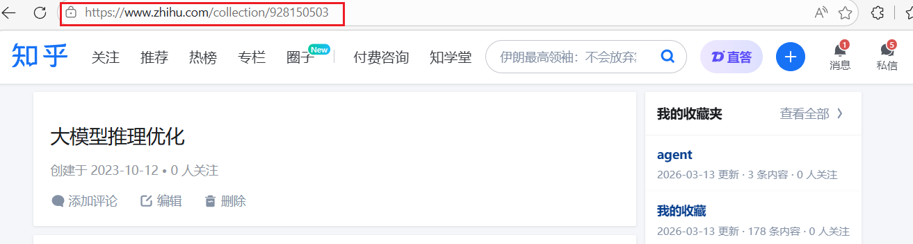
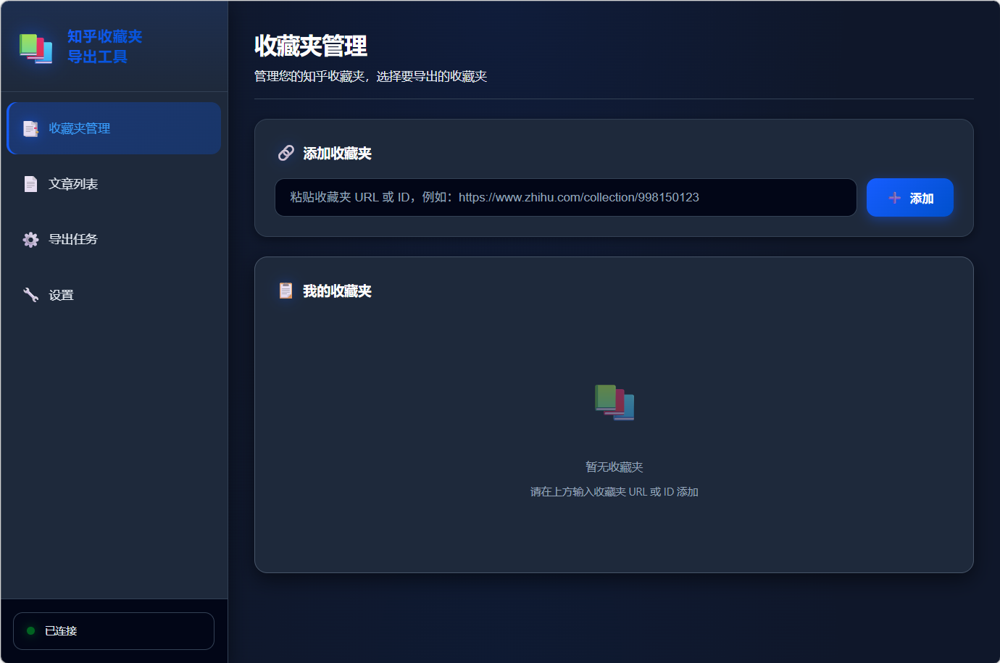
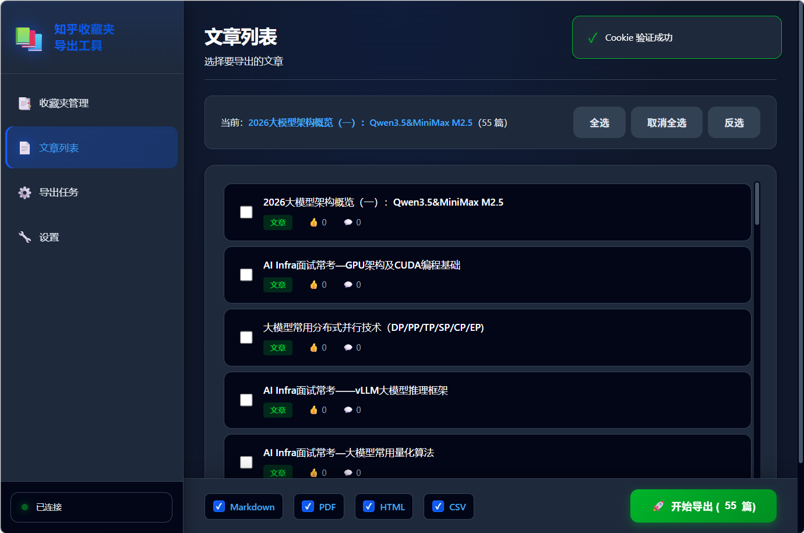
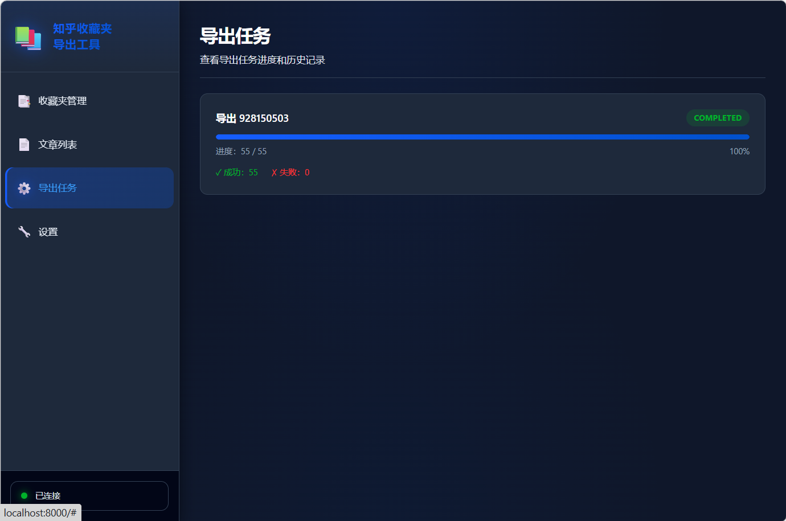

# 知乎收藏夹导出工具

> 纯本地运行、无服务端依赖的知乎收藏夹导出工具

[](https://www.python.org/downloads/)
[](https://opensource.org/licenses/MIT)

---

## 功能特性

- ✅ **Cookie 授权** - 加密存储，安全验证
- ✅ **收藏夹管理** - 列表展示，选择导出
- ✅ **内容抓取** - 回答、专栏文章完整抓取
- ✅ **多格式导出** - Markdown、PDF、HTML 单文件、CSV 台账
- ✅ **进度展示** - 实时进度条，失败重试
- ✅ **图片本地化** - 自动下载图片到本地
- ✅ **版权声明** - 每篇内容添加合规声明

---

## 安装依赖

```bash
pip install -r requirements.txt
```

**系统依赖（PDF 功能需要）：**

```bash
# Ubuntu/Debian
sudo apt-get install libpango1.0-dev libharfbuzz-dev libffi-dev libcairo2-dev

# macOS
brew install pango harfbuzz cairo pango gdk-pixbuf
```

## 获取cookie

获取方式：使用Cookie Editor浏览器插件，如下图：



## Web UI方式（推荐）

```python
python web/server.py
```

浏览器访问：http://localhost:8000


配置cookie和输出路径



获取收藏夹url，并填入





选择要导出的文章列表



导出，等待进度条


## 命令行方式
###  配置 Cookie

```bash
python cli/main.py auth
```

按提示输入 Cookie 字符串。


### 列出收藏夹

该功能暂时不可用

```bash
python cli/main.py list
```

### 导出收藏夹

```bash
# 导出为 Markdown
python cli/main.py export <COLLECTION_ID> -f md

# 导出为 PDF
python cli/main.py export <COLLECTION_ID> -f pdf

# 导出为 HTML 单文件（离线浏览）
python cli/main.py export <COLLECTION_ID> -f html

# 导出为 CSV 台账（元数据索引）
python cli/main.py export <COLLECTION_ID> -f csv

# 同时导出多种格式
python cli/main.py export <COLLECTION_ID> -f md -f pdf -f html -f csv
```

---

### 命令参考

| 命令 | 描述 |
|------|------|
| `auth` | Cookie 授权配置 |
| `list` | 列出所有收藏夹 |
| `export` | 导出指定收藏夹 |
| `zip` | 打包已导出的收藏夹为 ZIP |

#### export 命令选项

```
--output, -o PATH    输出目录 (默认：./downloads)
--format, -f TEXT    导出格式：md, pdf, html, csv (可多次指定)
--delay-min INT      最小延迟秒数 (默认：1)
--delay-max INT      最大延迟秒数 (默认：3)
--resume             断点续传，跳过已导出的文章
--force              强制重新导出所有内容
--dedupe             启用内容去重
```

#### zip 命令选项

```
--output, -o PATH    输出目录 (默认：./downloads)
--format, -f TEXT    包含的格式：md, pdf, html, csv (可多次指定)
--no-timestamp       文件名不包含时间戳
```

#### 输出目录结构

```
downloads/collection_<ID>/
├── markdown/       # Markdown 格式（含 assets 图片目录）
├── pdf/            # PDF 格式
├── html/           # HTML 单文件格式（离线浏览）
└── csv/            # CSV 台账（元数据索引）
```

---

## 项目结构

```
zhihu_download/
├── ai_agent/              # AI Agent 文档
│   ├── 01-requirements.md # 需求规格
│   ├── 02-technical-design.md  # 技术设计
│   ├── 03-progress-log.md # 进度日志
│   └── 04-user-guide.md   # 用户指南
├── src/
│   ├── auth/              # 授权模块
│   │   ├── encryptor.py   # 加密存储
│   │   └── cookie_auth.py # Cookie 管理
│   ├── crawler/           # 抓取模块
│   │   └── fetcher.py     # 内容抓取
│   ├── converter/         # 转换模块
│   │   ├── markdown.py    # Markdown 转换
│   │   ├── pdf.py         # PDF 转换
│   │   ├── html.py        # HTML 单文件
│   │   └── csv.py         # CSV 台账
│   ├── exporter/          # 导出控制模块
│   │   ├── progress.py    # 进度追踪/断点续传
│   │   └── zipper.py      # ZIP 压缩打包
│   └── utils/             # 工具函数
│       └── helpers.py     # 辅助函数
├── cli/
│   └── main.py            # CLI 入口
├── web/                   # Web UI
│   ├── server.py          # FastAPI 服务器
│   ├── templates/         # HTML 模板
│   └── static/            # 静态资源（CSS、JS）
├── mcp/                   # MCP Server
│   └── server.py          # MCP Skill 接口
├── requirements.txt       # 依赖清单
└── README.md              # 本文件
```

---

## 合规说明

⚠️ **重要提示**：本工具仅供**个人非商用学习备份**使用

- ✅ 导出自己有权限访问的收藏夹
- ✅ 个人离线阅读、知识管理
- ❌ 不得用于商用分发
- ❌ 不得抓取付费内容全文
- ❌ 不得高频请求影响知乎服务

---

## 高级功能

### 增量导出/断点续传

```bash
# 继续未完成的导出（跳过已导出的文章）
python cli/main.py export <COLLECTION_ID> --resume

# 强制重新导出（忽略已存在的文件）
python cli/main.py export <COLLECTION_ID> --force
```

### ZIP 压缩打包

```bash
# 将已导出的收藏夹打包为 ZIP
python cli/main.py zip <COLLECTION_ID>

# 指定包含的格式
python cli/main.py zip <COLLECTION_ID> -f md -f pdf

# 文件名不包含时间戳
python cli/main.py zip <COLLECTION_ID> --no-timestamp
```

### 内容去重（可选）

```bash
# 启用内容去重（跳过内容相同的文章）
python cli/main.py export <COLLECTION_ID> --dedupe
```

---


---

## 技术栈

- **HTTP 请求**: httpx
- **HTML 解析**: BeautifulSoup4 + lxml
- **Markdown 转换**: markdownify
- **PDF 生成**: weasyprint
- **CLI 框架**: typer + rich
- **加密**: cryptography

---

## 使用方式对比

| 方式 | 适用场景 | 启动命令 |
|------|----------|----------|
| CLI 命令行 | 熟悉终端、批处理、脚本集成 | `python cli/main.py` |
| Web UI | 图形界面、交互式操作 | `python web/server.py` |
| MCP Skill | AI Agent 集成、自然语言调用 | 配置 MCP Server |

---

## MCP Server 配置

在 Claude Code 或其他 MCP 客户端配置中添加：

```json
{
  "mcpServers": {
    "zhihu-collections": {
      "command": "python",
      "args": ["/absolute/path/to/zhihu_download/mcp/server.py"]
    }
  }
}
```

配置后可通过自然语言调用，如：
- "帮我列出所有知乎收藏夹"
- "导出收藏夹 998150123 为 Markdown 格式"

---

## 参考项目

基于 [Zhihu-Collections-MCP](https://github.com/JasonJarvan/Zhihu-Collections-MCP) 项目改造增强

---

## License

MIT License
